# Landing

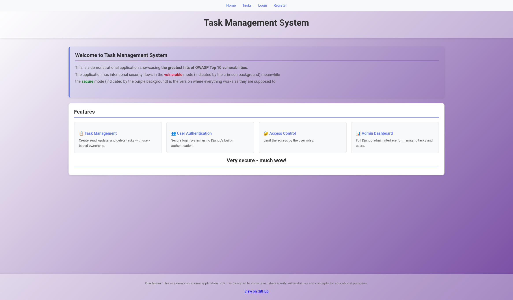

# Login

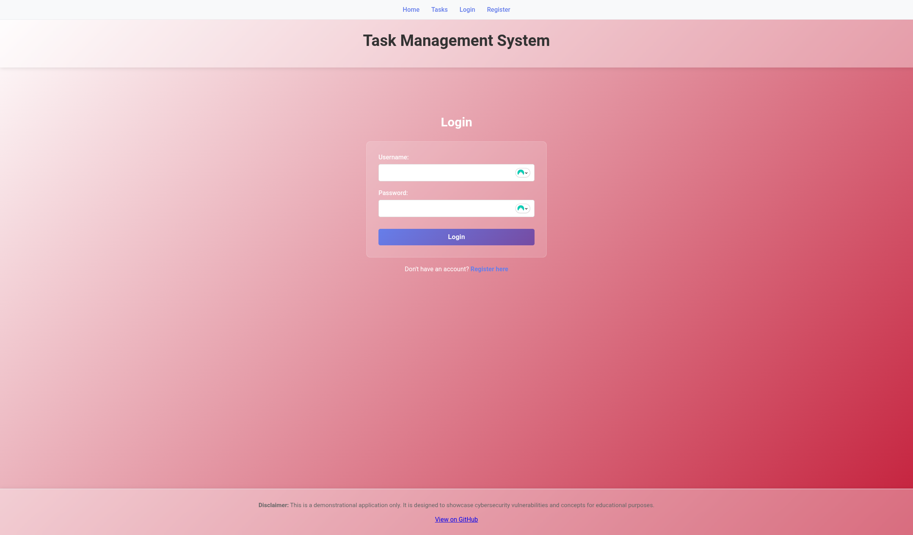
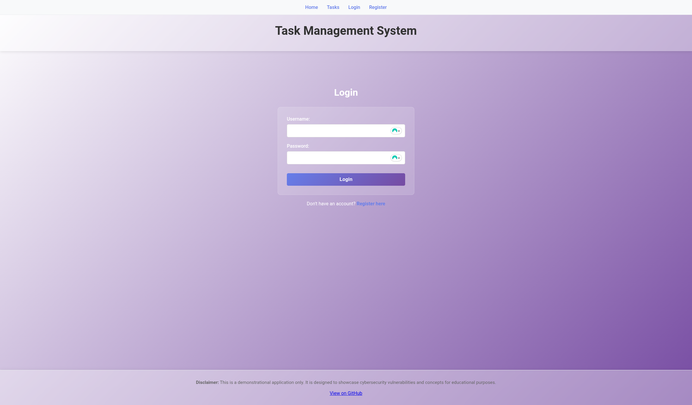

# Register

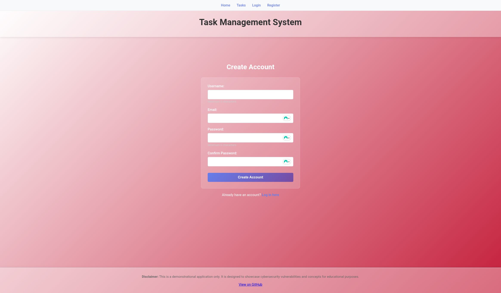
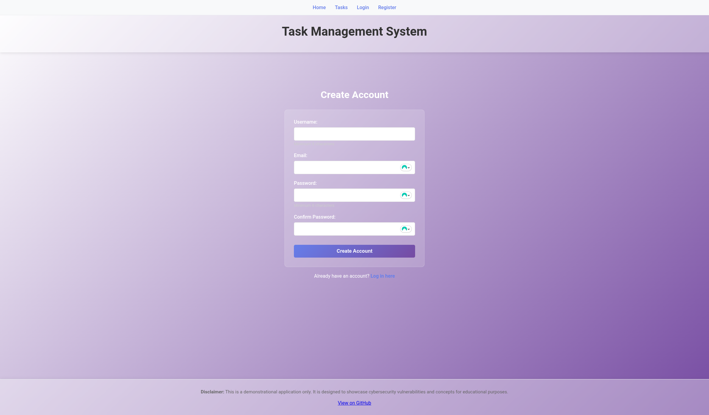

# Tasks

## Unlogged

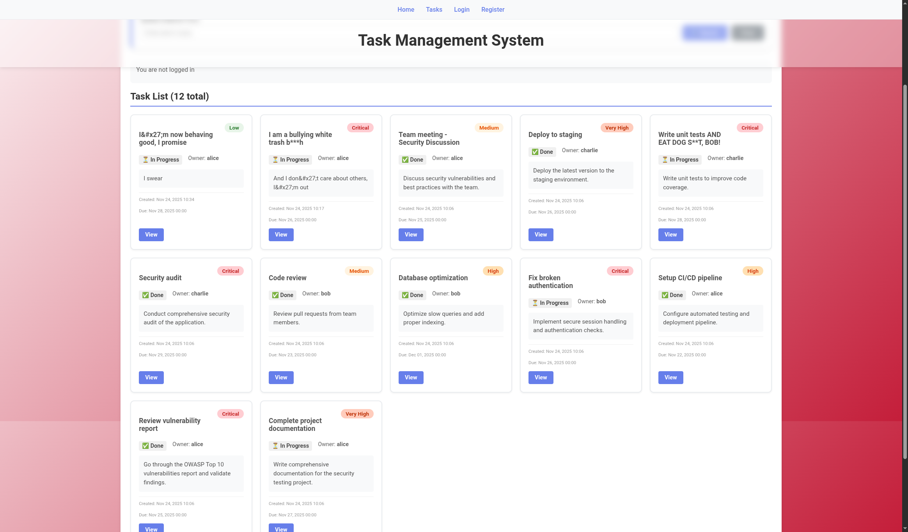
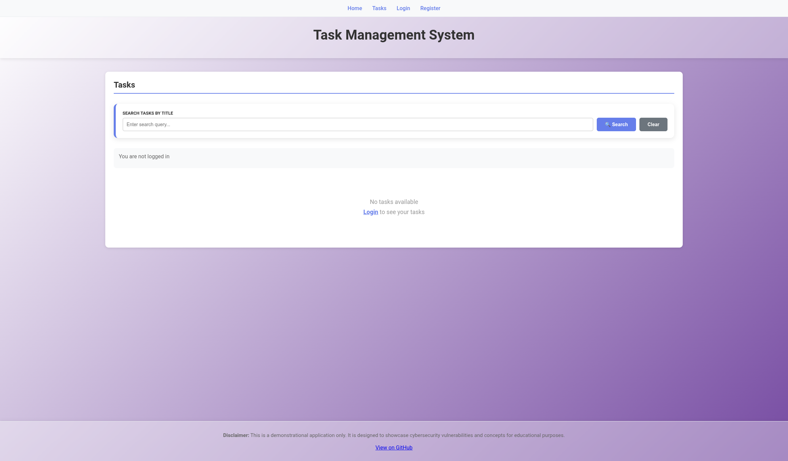

## Logged

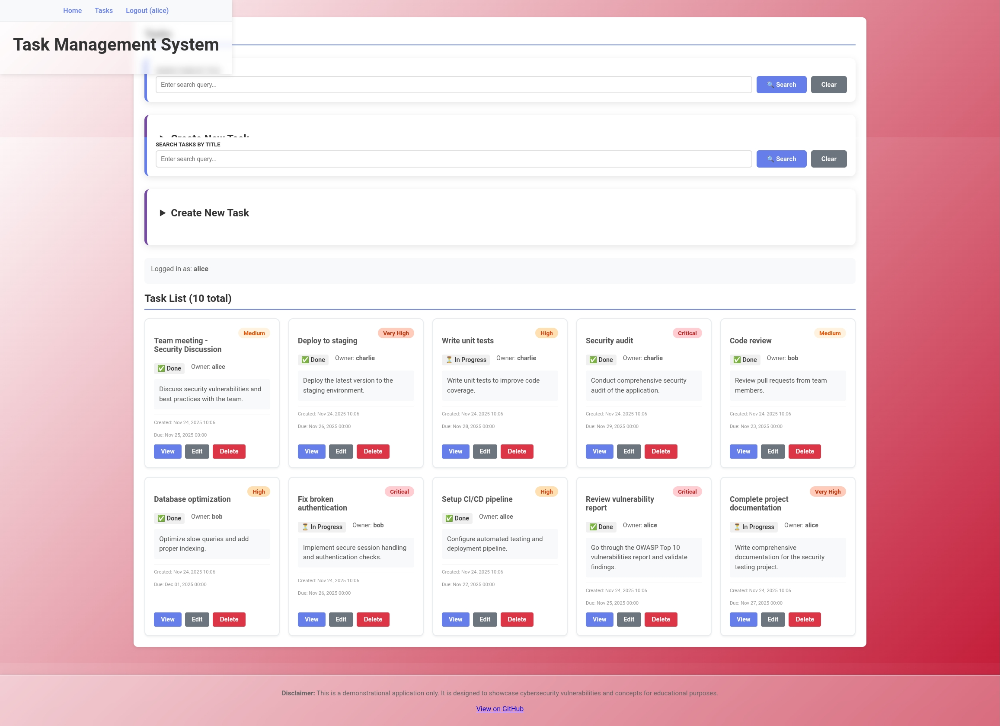
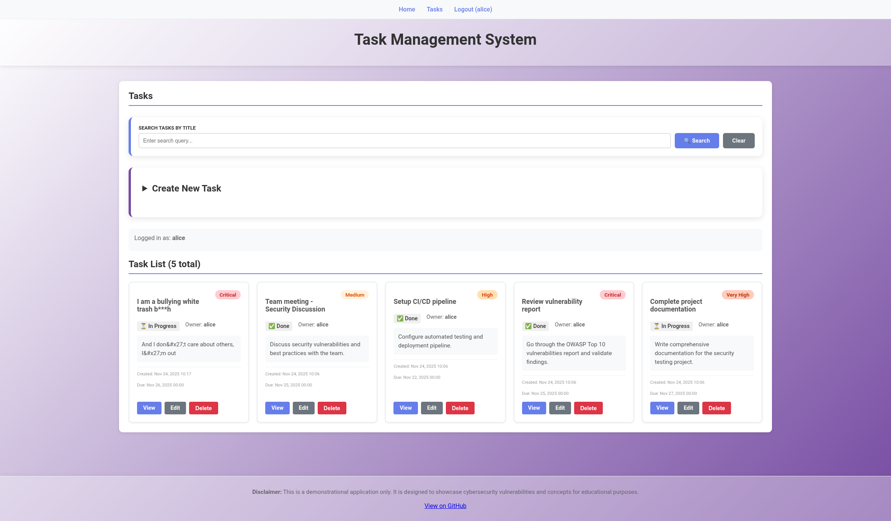

# Details

Unlogged vulnerable mode task detail, no edit capabilities

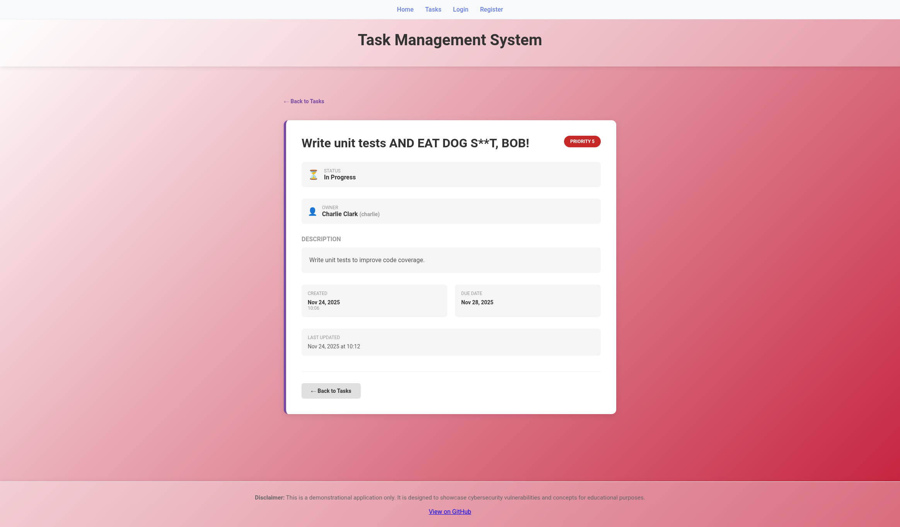

# Edit

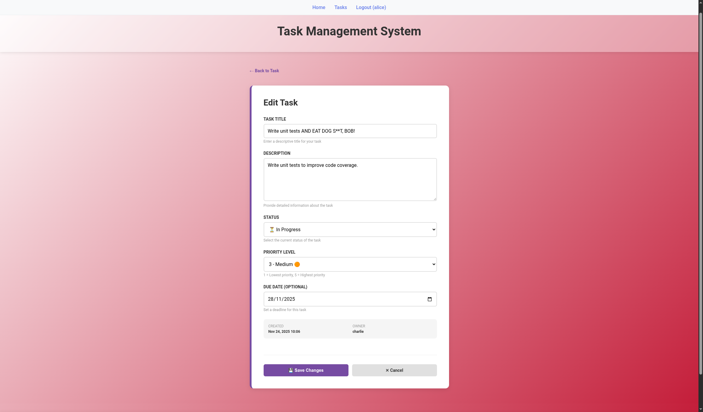
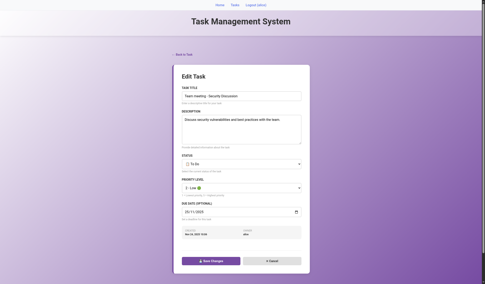

# Delete

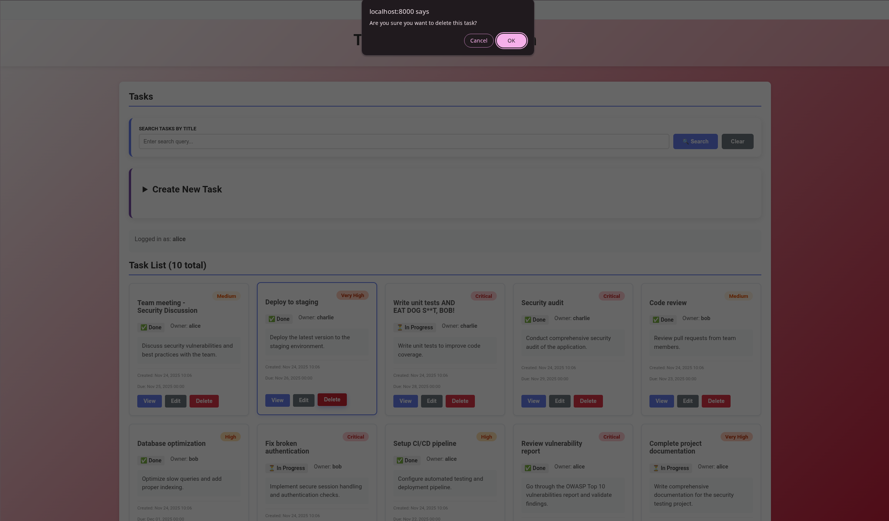
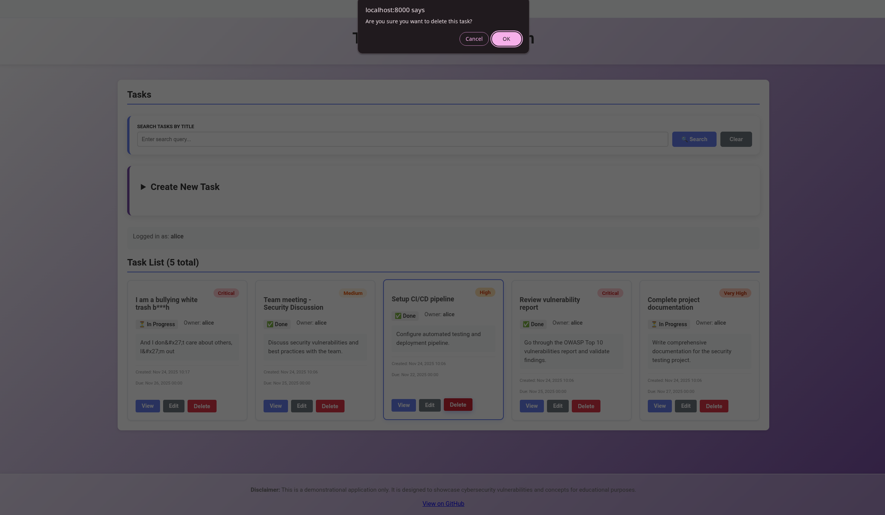

# Create

## Form

Form itself works the same in both variants

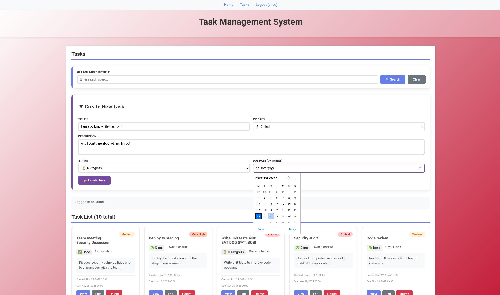

## Details after creating a task

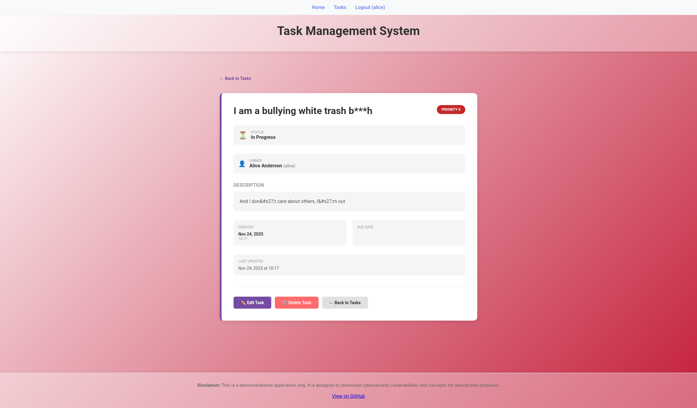

# SQL-injection

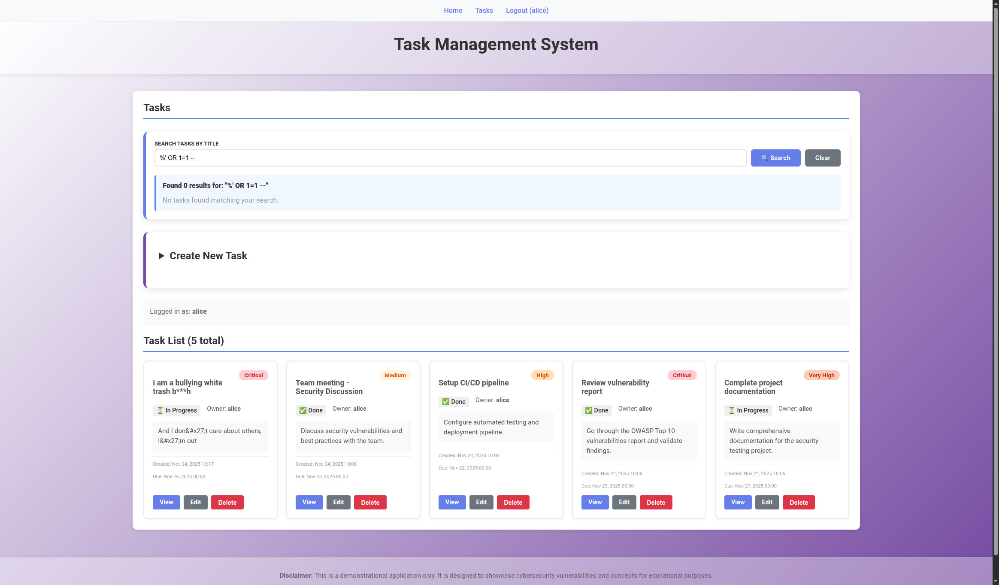

# Logs

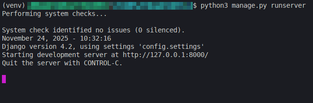
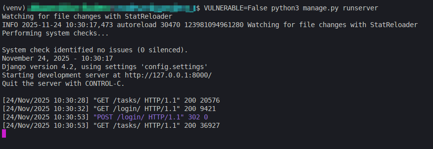